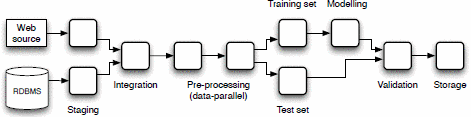
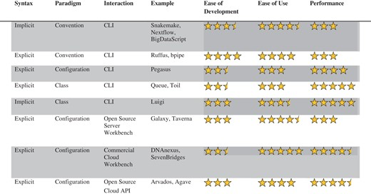

## Disclaimer

Everything on this presentation is based on available documentation, and my (very) limited experience:

- **CWL**: (part of) one project
- **Snakemake**: intro workshop, toy examples
- **Nextflow**: docs only

## Scientific Workflow Systems

{fig-align="center" width="70%"}

- **Cross-language** tool integration
- **Dependency management**: result caching, checkpointing, and partial re-execution
- **Resource management**: cluster/cloud support, scalable parallel execution
- **Error management**: health checks & retries
- **Provenance tracking**: logging & reporting of metadata
- **Containerization**


## No shortage of options
<https://github.com/meirwah/awesome-workflow-engines/>

\ 

#### Why these three?

:::: {.columns}

::: {.column width="40%"}
-   Open Source
-   Popular for Scientific Workflows
-   Lightweight, easy to setup (cf. _Galaxy_)
:::

::: {.column width="60%"}
{.lightbox}
:::

::::

## Developer & user-base

#### [Nextflow](https://github.com/nextflow-io/nextflow)
-   _sequera_ (Bioinformatics software company) , `nf_core` (community)
-   2.8 k⭐ (GitHub)
-   Bioinformatics, some image processing & ML

#### [Snakemake](https://github.com/snakemake/snakemake)
-   Johannes Köster (CS Bioinformatics at University of Duisburg-Essen)
-   2.3 k⭐(GitHub)
-   Bioinformatics

#### [CWL](https://github.com/common-workflow-language)
-   CWL Community, Leadership- & Technical Team[^1] 
-   0.3 k⭐(GitHub, cwltool)
-   Bioinformatics, astronomy, meteorology, health science

[^1]: Including (eScience Lab @ UOM)[https://esciencelab.org.uk/activities/cwl/)


## User-base (cont.)

```{=html}
  <script type="text/javascript" src="https://ssl.gstatic.com/trends_nrtr/3940_RC01/embed_loader.js"></script>
  <script type="text/javascript">
    trends.embed.renderExploreWidget("TIMESERIES", {"comparisonItem":[{"keyword":"/g/11h3lfyctn","geo":"","time":"2004-01-01 2025-01-13"},{"keyword":"/g/11r6x6wjfr","geo":"","time":"2004-01-01 2025-01-13"},{"keyword":"/g/11h4q983sx","geo":"","time":"2004-01-01 2025-01-13"}],"category":0,"property":""}, {"exploreQuery":"date=all&q=%2Fg%2F11h3lfyctn,%2Fg%2F11r6x6wjfr,%2Fg%2F11h4q983sx&hl=en","guestPath":"https://trends.google.com:443/trends/embed/"});
  </script>
```

## Design & Platform 

#### Snakemake
-   **_Workflow Engine_**, Windows & UNIX (Conda)
-   Python dialect (custom parser)
-   Minimal, focus on simplicity.

#### Nextflow
-   **_Workflow Engine_**, UNIX (Bash, Java 11+)
-   YAML + Groovy DSL (Java dialect)
-   Focus on flexibility, scalability & performance

#### CWL
-   **_2 Specifications_** + runners (e.g. `cwltool`, `Toil`, `Arvados`, UNIX)
-   YAML + JavaScript
-   Verbose & explicit, focus on interoperability


## Worflow Patterns

How dependencies are tracked and execution is controlled.

#### Snakemake
-   Wildcard-based, relies on IO directory structure
-   Input/output functions allow for dynamic names
-   Target-driven (predefined output names!)

#### Nextflow
-   Dataflow model (processes, channels, operators)
-   Output globbing (flat output directory)
-   Input globbing (_Channel Factories_)

#### CWL
-   Explicit inputs & outputs
-   Output globbing (flat output directory)
-   Input/output JS expressions
-   Step/data/target-driven (`cwltool`)


## Staging / Checkpointing

Whether tools run in isolated directories, and interrupted workflows can be resumed.

#### Snakemake
-   Optional staging, default execution in directory hierarchy
-   Reactive evaluation (optional re-evaluation `-F`)

#### Nextflow
-   Automatic staging
-   Reactive evaluation (optional `-resume`)

#### CWL
-   Explicit staging
-   Optional `--cachedir` (patchy in `cwltool`)


## Example

A bash script that "processes" some CSV data:

```{.bash include="examples/dummy.sh" filename="dummy.sh" code-line-numbers="true"}
```

## Snakemake

```{.yaml include="examples/snakemake/process.smk" filename="process.smk" code-line-numbers="true"}
```

## Nextflow

```{.yaml include="examples/nextflow/process.nf" filename="process.nf" code-line-numbers="true"}
```

## CWL (data)

```{.yaml include="examples/cwl/inputs.yml" filename="inputs.yml"}
```

## CWL (tool)

```{.yaml include="examples/cwl/tool.cwl" filename="tool.cwl" code-line-numbers="true"}
```

## CWL (workflow)

```{.yaml include="examples/cwl/process.cwl" filename="process.cwl" code-line-numbers="true"}
```


## Documentation

#### Snakemake
-   Basic tutorials & user-guide
-   Limited API docs
-   Very limited CLI help

#### Nextflow
-   Basic tutorials & user-guide
-   Implementation patterns
-   Limited API docs

#### CWL
-   Basic tutorials & user-guide
-   Implementation patterns
-   Full Specification
-   Very limited CLI help (cwltool)

## Interoperability

#### Snakemake
-   Run CWL tools
-   CWL export (using `Snakemake` container)
-   Handover to `Nextflow`

#### Nextflow
-   Prototype conversion to CWL (abandonded)

#### CWL
Waits for everyone to conform.


## Modularity

#### Snakemake
-   Rules & Workflows can be _included_ (`config`, `log`, etc. are global)
-   ... or imported as _modules_ (allows name-spacing)
-   Changes allowed to everything except execution step

#### Nextflow
-   Processes and workflows must be defined in "module files"
-   Changes to parameters and data

#### CWL
-   Parent must use `SubworkflowFeatureRequirement`
-   All parameters are inputs (and are namespaced)
-   Self-contained documentation & validators


## Modularity (Snakemake)

```{.yaml filename="snakemake" code-line-numbers="true"}
configfile: "config/config.yaml"

module other_workflow:
    snakefile: github("snakemake-workflows/github_module",
                      path = "workflow/Snakefile", 
                      tag = "v2.0.1")

    config: config["other-workflow"]

use rule some_task from other_workflow as other_some_task with:
    output:
        "results/some-result.txt"
```

## Task support

What can be considered an execution step?

#### Snakemake
Bash, Python, R

#### Nextflow
Linux scripts: Bash, Perl, Ruby, Python, etc.; Groovy

#### CWL
Bash, JavaScript, other scripts can be "inlined"


## Inlining scripts on CWL

```{.yaml filename="CWL" code-line-numbers="true"}
baseCommand: ["python3", "say_hello.py"]

requirements:
  InitialWorkDirRequirement:
    listing:
      - entryname: say_hello.py
        entry: |-
          print("Hello")
```

## Configuration

#### Snakemake
-   One or more YAML/JSON/YTE files (inheritance-based hierarchy)
-   External validation (json.schema)
-   CLI override

#### Nextflow
-   Custom format (allows string-interpolation)
-   Conditional profiles, and special "scopes" (e.g. `env`, `executor`, `conda`)
-   CLI override

#### CWL
-   Dedicated inputs YAML file
-   Built-in validation for various types (JS-extensible)
-   Overrides via additional YAML file


## Logging & Reporting

#### Snakemake
-   `log` placeholder (does nothing on its own)
-   Provenance `--summary` (limited)
-   HTML reports (requires custom annotation)

#### Nextflow
-   `stdout` output type
-   Trace & Execution HTML reports (customizable)

#### CWL
-   `stdout` as output
-   Concise runner logs

## Containarization

#### Snakemake
-   Conda
-   Singularity, Apptainer, Docker

#### Nextflow
-   Conda / Spack / Wave
-   Apptainer, Docker, Sarus, Shifter, Singularity

#### CWL
-   Docker, udocker, Singularity (experimental)


## Cluster/Cloud execution

#### Snakemake
-   SLURM, "Generic cluster support"
-   Kubernets, Google Cloud Platform (GCP)

#### Nextflow
-   Open Grid Engine, Univa Grid Engine, Platform LSF, Linux SLURM, Flux Framework, PBS Works, Torque, HTCondor
-   Amazon Web Services (AWS), GCP, Kubernetes

#### CWL (Toil)
-   Grid Engine, LSF, SLURM, Torque, HTCondor
-   Amazon Web Services (AWS), Google Cloud Platform (GCP), Kubernetes


## Conclussion

#### Snakemake \[_Research/Prototyping-Friendly_\]

-   Nice for in-place execution
-   Wildcard expansion (if it fits your tools)

\- _Too_ flexible? (lacks structure or best practices), poorly documented (outside existing Omics workflows)

#### Nextflow \[_HPC-Friendly_\]
-   Scripting language support, stubs, input/output globbing
-   Fine-grained execution control

\- Steep learning curve (Groovy)

#### CWL \[_API-Friendly_\]
-   Well structured and robust
-   Best documented (specification), clear error reporting

\- Annoyingly verbose, and rigid. Support for runners is patchy.

## References

Jeremy Leipzig, A review of bioinformatic pipeline frameworks, Briefings in Bioinformatics, Volume 18, Issue 3, May 2017, Pages 530–536, https://doi.org/10.1093/bib/bbw020

V. Curcin and M. Ghanem, "Scientific workflow systems - can one size fit all?," 2008 Cairo International Biomedical Engineering Conference, Cairo, Egypt, 2008, pp. 1-9, https://doi.org/10.1109/CIBEC.2008.4786077
